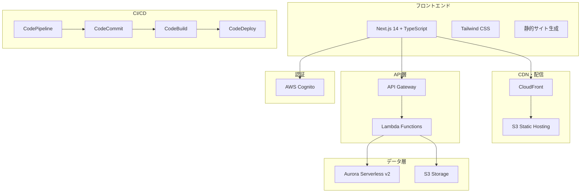

# 設計文書

## 概要

Portfolio Hub は、写真家とインフラエンジニア両方の専門性を洗練されたデザインでアピールする個人ポートフォリオサイトです。AWS サーバレスアーキテクチャを採用し、コスト効率と技術学習を両立させます。

## アーキテクチャ

### 全体アーキテクチャ



### レイヤー構成

#### 1. プレゼンテーション層
- **Next.js 14**: React ベースのフロントエンドフレームワーク
- **TypeScript**: 型安全性とコード品質向上
- **Tailwind CSS**: ユーティリティファーストのCSS フレームワーク
- **静的サイト生成**: ビルド時にHTMLを生成、高速表示

#### 2. 配信層
- **CloudFront**: グローバルCDN、キャッシュ最適化
- **S3**: 静的ファイルホスティング、画像ストレージ

#### 3. API層
- **API Gateway**: RESTful API エンドポイント
- **Lambda Functions**: サーバレス関数（Python）

#### 4. データ層
- **Aurora Serverless v2**: PostgreSQL、0 ACU対応
- **S3**: 画像・ファイルストレージ

#### 5. 認証層
- **AWS Cognito**: ユーザー認証・認可

## コンポーネントとインターフェース

### フロントエンドコンポーネント

#### 1. レイアウトコンポーネント
```typescript
// components/Layout.tsx
interface LayoutProps {
  children: React.ReactNode;
  title?: string;
  description?: string;
}

// components/Navigation.tsx
interface NavigationProps {
  currentPath: string;
}

// components/Footer.tsx
interface FooterProps {
  socialLinks: SocialLink[];
}
```

#### 2. ポートフォリオコンポーネント
```typescript
// components/PhotoGallery.tsx
interface PhotoGalleryProps {
  photos: Photo[];
  category?: string;
}

// components/ProjectCard.tsx
interface ProjectCardProps {
  project: EngineeringProject;
  showDetails?: boolean;
}

// components/BlogCard.tsx
interface BlogCardProps {
  post: BlogPost;
  excerpt?: boolean;
}
```

#### 3. 管理コンポーネント
```typescript
// components/admin/ContentEditor.tsx
interface ContentEditorProps {
  content: Content;
  onSave: (content: Content) => void;
  onCancel: () => void;
}

// components/admin/MediaUploader.tsx
interface MediaUploaderProps {
  onUpload: (files: File[]) => void;
  acceptedTypes: string[];
  maxSize: number;
}
```

### バックエンドAPI設計

#### 1. 認証API
```python
# /auth
POST /auth/login
POST /auth/logout
POST /auth/refresh
GET  /auth/profile
```

#### 2. コンテンツAPI
```python
# /api/content
GET    /api/content/profile
PUT    /api/content/profile
GET    /api/content/photos
POST   /api/content/photos
PUT    /api/content/photos/{id}
DELETE /api/content/photos/{id}
GET    /api/content/projects
POST   /api/content/projects
PUT    /api/content/projects/{id}
DELETE /api/content/projects/{id}
```

#### 3. ブログAPI
```python
# /api/blog
GET    /api/blog/posts
POST   /api/blog/posts
GET    /api/blog/posts/{id}
PUT    /api/blog/posts/{id}
DELETE /api/blog/posts/{id}
```

## データモデル

### データベーススキーマ（PostgreSQL）

#### 1. ユーザー管理
```sql
-- users テーブル
CREATE TABLE users (
    id UUID PRIMARY KEY DEFAULT gen_random_uuid(),
    cognito_user_id VARCHAR(255) UNIQUE NOT NULL,
    email VARCHAR(255) UNIQUE NOT NULL,
    name VARCHAR(255) NOT NULL,
    role VARCHAR(50) DEFAULT 'user',
    created_at TIMESTAMP DEFAULT CURRENT_TIMESTAMP,
    updated_at TIMESTAMP DEFAULT CURRENT_TIMESTAMP
);
```

#### 2. プロフィール情報
```sql
-- profiles テーブル
CREATE TABLE profiles (
    id UUID PRIMARY KEY DEFAULT gen_random_uuid(),
    user_id UUID REFERENCES users(id) ON DELETE CASCADE,
    title VARCHAR(255),
    bio TEXT,
    skills JSONB,
    contact_info JSONB,
    social_links JSONB,
    created_at TIMESTAMP DEFAULT CURRENT_TIMESTAMP,
    updated_at TIMESTAMP DEFAULT CURRENT_TIMESTAMP
);
```

#### 3. 写真ポートフォリオ
```sql
-- photo_categories テーブル
CREATE TABLE photo_categories (
    id UUID PRIMARY KEY DEFAULT gen_random_uuid(),
    name VARCHAR(255) NOT NULL,
    description TEXT,
    sort_order INTEGER DEFAULT 0,
    created_at TIMESTAMP DEFAULT CURRENT_TIMESTAMP
);

-- photos テーブル
CREATE TABLE photos (
    id UUID PRIMARY KEY DEFAULT gen_random_uuid(),
    category_id UUID REFERENCES photo_categories(id),
    title VARCHAR(255) NOT NULL,
    description TEXT,
    file_path VARCHAR(500) NOT NULL,
    thumbnail_path VARCHAR(500),
    metadata JSONB, -- カメラ設定、撮影情報
    sort_order INTEGER DEFAULT 0,
    is_featured BOOLEAN DEFAULT FALSE,
    created_at TIMESTAMP DEFAULT CURRENT_TIMESTAMP,
    updated_at TIMESTAMP DEFAULT CURRENT_TIMESTAMP
);
```

#### 4. エンジニアリングプロジェクト
```sql
-- project_categories テーブル
CREATE TABLE project_categories (
    id UUID PRIMARY KEY DEFAULT gen_random_uuid(),
    name VARCHAR(255) NOT NULL,
    description TEXT,
    sort_order INTEGER DEFAULT 0,
    created_at TIMESTAMP DEFAULT CURRENT_TIMESTAMP
);

-- engineering_projects テーブル
CREATE TABLE engineering_projects (
    id UUID PRIMARY KEY DEFAULT gen_random_uuid(),
    category_id UUID REFERENCES project_categories(id),
    title VARCHAR(255) NOT NULL,
    description TEXT,
    tech_stack JSONB,
    github_url VARCHAR(500),
    demo_url VARCHAR(500),
    image_paths JSONB,
    sort_order INTEGER DEFAULT 0,
    is_featured BOOLEAN DEFAULT FALSE,
    created_at TIMESTAMP DEFAULT CURRENT_TIMESTAMP,
    updated_at TIMESTAMP DEFAULT CURRENT_TIMESTAMP
);
```

#### 5. ブログ
```sql
-- blog_posts テーブル
CREATE TABLE blog_posts (
    id UUID PRIMARY KEY DEFAULT gen_random_uuid(),
    user_id UUID REFERENCES users(id),
    title VARCHAR(255) NOT NULL,
    slug VARCHAR(255) UNIQUE NOT NULL,
    content TEXT NOT NULL,
    excerpt TEXT,
    tags JSONB,
    status VARCHAR(20) DEFAULT 'draft', -- draft, published
    reading_time INTEGER, -- 分単位
    published_at TIMESTAMP,
    created_at TIMESTAMP DEFAULT CURRENT_TIMESTAMP,
    updated_at TIMESTAMP DEFAULT CURRENT_TIMESTAMP
);

-- インデックス
CREATE INDEX idx_blog_posts_status ON blog_posts(status);
CREATE INDEX idx_blog_posts_published_at ON blog_posts(published_at);
CREATE INDEX idx_blog_posts_slug ON blog_posts(slug);
```

### TypeScript型定義

```typescript
// types/index.ts
export interface User {
  id: string;
  cognitoUserId: string;
  email: string;
  name: string;
  role: 'admin' | 'user';
  createdAt: Date;
  updatedAt: Date;
}

export interface Profile {
  id: string;
  userId: string;
  title?: string;
  bio?: string;
  skills: string[];
  contactInfo: ContactInfo;
  socialLinks: SocialLink[];
  createdAt: Date;
  updatedAt: Date;
}

export interface Photo {
  id: string;
  categoryId: string;
  title: string;
  description?: string;
  filePath: string;
  thumbnailPath?: string;
  metadata: PhotoMetadata;
  sortOrder: number;
  isFeatured: boolean;
  createdAt: Date;
  updatedAt: Date;
}

export interface PhotoMetadata {
  camera?: string;
  lens?: string;
  settings?: {
    aperture?: string;
    shutterSpeed?: string;
    iso?: number;
  };
  location?: string;
  dateTaken?: Date;
}

export interface EngineeringProject {
  id: string;
  categoryId: string;
  title: string;
  description: string;
  techStack: string[];
  githubUrl?: string;
  demoUrl?: string;
  imagePaths: string[];
  sortOrder: number;
  isFeatured: boolean;
  createdAt: Date;
  updatedAt: Date;
}

export interface BlogPost {
  id: string;
  userId: string;
  title: string;
  slug: string;
  content: string;
  excerpt?: string;
  tags: string[];
  status: 'draft' | 'published';
  readingTime?: number;
  publishedAt?: Date;
  createdAt: Date;
  updatedAt: Date;
}
```

## 正確性プロパティの事前作業

<function_calls>
<invoke name="prework">
<parameter name="featureName">portfolio-hub
## 正確性プロパティ

*プロパティとは、システムのすべての有効な実行において真であるべき特性や動作のことです。本質的に、システムが何をすべきかについての形式的な記述です。プロパティは、人間が読める仕様と機械で検証可能な正確性保証の橋渡しとなります。*

### プロパティリフレクション

事前作業分析を確認した結果、以下の冗長性を特定しました：

**統合可能なプロパティ：**
- プロフィール情報表示（1.1, 1.2）→ 包括的なプロフィール表示プロパティに統合
- 記事表示情報（4.2, 5.1）→ 記事情報表示プロパティに統合  
- プロジェクト表示情報（3.2, 3.3, 3.4）→ プロジェクト情報表示プロパティに統合
- CRUD操作（6.3, 7.2, 8.3）→ データ永続化プロパティに統合

**Property 1: プロフィール情報完全表示**
*任意の* プロフィールデータに対して、レンダリング結果には経歴、スキル、連絡先情報がすべて含まれている必要がある
**検証対象: 要件 1.1, 1.2**

**Property 2: 写真カテゴリ別整理表示**
*任意の* 写真データセットに対して、同じカテゴリの写真は一緒にグループ化されて表示される必要がある
**検証対象: 要件 2.1**

**Property 3: 写真メタデータ表示**
*任意の* 写真データに対して、レンダリング結果には撮影情報（カメラ設定、場所、日時）が含まれている必要がある
**検証対象: 要件 2.4**

**Property 4: 画像遅延読み込み動作**
*任意の* 画像リストに対して、初期表示時には可視範囲の画像のみが読み込まれ、スクロール時に追加画像が読み込まれる必要がある
**検証対象: 要件 2.5**

**Property 5: プロジェクト技術スタック別整理**
*任意の* エンジニアリングプロジェクトデータセットに対して、同じ技術スタックを含むプロジェクトは一緒にグループ化されて表示される必要がある
**検証対象: 要件 3.1**

**Property 6: プロジェクト情報完全表示**
*任意の* プロジェクトデータに対して、レンダリング結果にはプロジェクト概要、使用技術、GitHubリンク、デモリンク、スクリーンショットがすべて含まれている必要がある
**検証対象: 要件 3.2, 3.3, 3.4**

**Property 7: ブログ記事日時降順ソート**
*任意の* ブログ記事データセットに対して、表示順序は投稿日時の降順（新しい順）である必要がある
**検証対象: 要件 4.1**

**Property 8: 記事情報完全表示**
*任意の* 記事データに対して、レンダリング結果にはタイトル、投稿日、概要（一覧時）または全文（詳細時）、投稿日時が含まれている必要がある
**検証対象: 要件 4.2, 5.1**

**Property 9: ページネーション正常動作**
*任意の* 大量記事データセットに対して、指定されたページサイズで記事が分割され、各ページに正しい範囲の記事が表示される必要がある
**検証対象: 要件 4.3**

**Property 10: Markdown HTML変換**
*任意の* 有効なMarkdownテキストに対して、HTMLに変換後、再度Markdownに変換すると構造的に等価な結果が得られる必要がある
**検証対象: 要件 5.2**

**Property 11: シンタックスハイライト機能**
*任意の* コードブロックを含むMarkdownに対して、HTML変換結果にはシンタックスハイライト用のCSSクラスまたはスタイルが適用されている必要がある
**検証対象: 要件 5.3**

**Property 12: 読了時間計算**
*任意の* 記事内容に対して、計算された読了時間は文字数に基づく合理的な範囲内（1分あたり200-400文字）である必要がある
**検証対象: 要件 5.4**

**Property 13: データ永続化ラウンドトリップ**
*任意の* 有効なデータ（記事、写真、プロジェクト）に対して、保存後にデータベースから取得したデータは保存前のデータと等価である必要がある
**検証対象: 要件 6.3, 7.2, 8.3**

**Property 14: 下書き状態管理**
*任意の* 記事データに対して、下書きとして保存された記事は公開記事一覧には表示されず、管理画面でのみ表示される必要がある
**検証対象: 要件 6.5**

**Property 15: 記事状態切り替え**
*任意の* 記事に対して、公開状態から下書き状態への変更、またはその逆の変更が正しく反映される必要がある
**検証対象: 要件 7.4**

**Property 16: 画像最適化処理**
*任意の* アップロードされた画像に対して、自動リサイズ処理後の画像は指定されたサイズ制限内であり、元画像の縦横比が保持されている必要がある
**検証対象: 要件 8.4**

**Property 17: 表示順序変更機能**
*任意の* ポートフォリオアイテムリストに対して、順序変更操作後の表示順序は指定された新しい順序と一致する必要がある
**検証対象: 要件 8.5**

## プロジェクト構成

### 推奨ディレクトリ構造

#### ルートディレクトリ
```
portfolio-hub/
├── frontend/             # Next.js アプリケーション
├── backend/              # Python Lambda 関数
├── terraform/            # インフラ構成
├── docs/                 # プロジェクトドキュメント
├── .github/              # GitHub Actions (CI/CD)
├── docker/               # 開発環境用Docker設定
└── scripts/              # デプロイ・管理スクリプト
```

#### フロントエンド構成（Next.js 14 App Router）
```
frontend/
├── src/
│   ├── app/                    # App Router
│   │   ├── (public)/          # 公開ページグループ
│   │   │   ├── page.tsx       # ホームページ
│   │   │   ├── about/         # プロフィール
│   │   │   ├── portfolio/     # ポートフォリオ
│   │   │   │   ├── photography/
│   │   │   │   └── engineering/
│   │   │   └── blog/          # ブログ
│   │   ├── (admin)/           # 管理画面グループ
│   │   │   ├── dashboard/
│   │   │   ├── posts/
│   │   │   └── portfolio/
│   │   ├── api/               # API Routes
│   │   │   ├── auth/
│   │   │   ├── blog/
│   │   │   └── portfolio/
│   │   ├── globals.css
│   │   ├── layout.tsx
│   │   └── loading.tsx
│   ├── components/            # 再利用可能コンポーネント
│   │   ├── ui/               # 基本UIコンポーネント
│   │   │   ├── Button.tsx
│   │   │   ├── Modal.tsx
│   │   │   ├── Input.tsx
│   │   │   └── index.ts      # バレルエクスポート
│   │   ├── layout/           # レイアウト関連
│   │   │   ├── Header.tsx
│   │   │   ├── Footer.tsx
│   │   │   ├── Navigation.tsx
│   │   │   └── Sidebar.tsx
│   │   ├── portfolio/        # ポートフォリオ特化
│   │   │   ├── PhotoGallery.tsx
│   │   │   ├── ProjectCard.tsx
│   │   │   └── Lightbox.tsx
│   │   ├── blog/             # ブログ関連
│   │   │   ├── PostCard.tsx
│   │   │   ├── PostEditor.tsx
│   │   │   └── MarkdownRenderer.tsx
│   │   └── forms/            # フォーム関連
│   │       ├── ContactForm.tsx
│   │       └── SearchForm.tsx
│   ├── hooks/                # カスタムフック
│   │   ├── useAuth.ts
│   │   ├── useApi.ts
│   │   ├── useLocalStorage.ts
│   │   └── useFormValidation.ts
│   ├── lib/                  # ライブラリ・設定
│   │   ├── auth.ts           # 認証設定
│   │   ├── api.ts            # API クライアント
│   │   ├── constants.ts      # 定数
│   │   └── validations.ts    # バリデーションルール
│   ├── types/                # TypeScript型定義
│   │   ├── auth.ts
│   │   ├── blog.ts
│   │   ├── portfolio.ts
│   │   └── index.ts
│   ├── utils/                # ユーティリティ関数
│   │   ├── formatters.ts     # データフォーマット
│   │   ├── helpers.ts        # ヘルパー関数
│   │   └── markdown.ts       # Markdown処理
│   └── styles/               # スタイル関連
│       ├── globals.css
│       └── components.css
├── public/                   # 静的ファイル
│   ├── images/
│   ├── icons/
│   └── favicon.ico
├── __tests__/                # テストファイル
│   ├── components/
│   ├── hooks/
│   ├── utils/
│   ├── properties/           # プロパティベーステスト
│   └── __mocks__/            # モックファイル
├── .env.local                # 環境変数
├── .env.example
├── next.config.js
├── tailwind.config.js
├── tsconfig.json
├── jest.config.js
└── package.json
```

#### バックエンド構成（Python Lambda）
```
backend/
├── src/
│   ├── handlers/             # Lambda関数ハンドラー
│   │   ├── __init__.py
│   │   ├── auth/
│   │   │   ├── __init__.py
│   │   │   ├── login.py
│   │   │   ├── logout.py
│   │   │   └── profile.py
│   │   ├── blog/
│   │   │   ├── __init__.py
│   │   │   ├── create_post.py
│   │   │   ├── get_posts.py
│   │   │   ├── update_post.py
│   │   │   └── delete_post.py
│   │   └── portfolio/
│   │       ├── __init__.py
│   │       ├── photos.py
│   │       └── projects.py
│   ├── services/             # ビジネスロジック
│   │   ├── __init__.py
│   │   ├── auth_service.py
│   │   ├── blog_service.py
│   │   ├── portfolio_service.py
│   │   └── image_service.py
│   ├── models/               # データモデル
│   │   ├── __init__.py
│   │   ├── base.py
│   │   ├── user.py
│   │   ├── blog_post.py
│   │   ├── photo.py
│   │   └── project.py
│   ├── utils/                # ユーティリティ
│   │   ├── __init__.py
│   │   ├── database.py       # DB接続・操作
│   │   ├── error_handler.py  # エラーハンドリング
│   │   ├── auth.py           # 認証ヘルパー
│   │   ├── validators.py     # バリデーション
│   │   └── image_processor.py # 画像処理
│   └── config/               # 設定管理
│       ├── __init__.py
│       ├── settings.py       # アプリケーション設定
│       └── database.py       # DB設定
├── tests/                    # テストファイル
│   ├── __init__.py
│   ├── conftest.py           # pytest設定
│   ├── unit/                 # 単体テスト
│   │   ├── test_services/
│   │   ├── test_models/
│   │   └── test_utils/
│   ├── integration/          # 統合テスト
│   │   ├── test_handlers/
│   │   └── test_api/
│   ├── properties/           # プロパティベーステスト
│   │   ├── test_blog_properties.py
│   │   └── test_portfolio_properties.py
│   └── fixtures/             # テストデータ
│       ├── blog_posts.json
│       └── photos.json
├── requirements/             # 依存関係管理
│   ├── base.txt              # 基本依存関係
│   ├── dev.txt               # 開発用依存関係
│   └── prod.txt              # 本番用依存関係
├── scripts/                  # デプロイ・管理スクリプト
│   ├── deploy.sh
│   └── migrate.py
├── .env.example
├── pytest.ini
└── setup.py
```

#### インフラ構成（Terraform）
```
terraform/
├── modules/                  # 再利用可能モジュール
│   ├── aurora/
│   │   ├── main.tf
│   │   ├── variables.tf
│   │   ├── outputs.tf
│   │   └── README.md
│   ├── lambda/
│   │   ├── main.tf
│   │   ├── variables.tf
│   │   ├── outputs.tf
│   │   └── README.md
│   ├── s3/
│   ├── cloudfront/
│   ├── api_gateway/
│   └── cognito/
├── environments/             # 環境別設定
│   ├── dev/
│   │   ├── main.tf
│   │   ├── variables.tf
│   │   ├── terraform.tfvars
│   │   └── backend.tf
│   ├── staging/
│   │   ├── main.tf
│   │   ├── variables.tf
│   │   ├── terraform.tfvars
│   │   └── backend.tf
│   └── prod/
│       ├── main.tf
│       ├── variables.tf
│       ├── terraform.tfvars
│       └── backend.tf
├── global/                   # 共通リソース
│   ├── s3_backend/           # Terraform State用S3
│   └── iam/                  # 共通IAMロール
├── scripts/                  # デプロイスクリプト
│   ├── deploy.sh
│   ├── destroy.sh
│   └── plan.sh
└── README.md
```

### 構成設計の原則

#### 1. **関心の分離**
- フロントエンド、バックエンド、インフラを明確に分離
- 各層内でも機能別・責任別に分離

#### 2. **スケーラビリティ**
- 新機能追加時の影響範囲を最小化
- モジュール化による再利用性向上

#### 3. **保守性**
- 一貫した命名規則
- 明確なディレクトリ階層
- 適切なファイル分割

#### 4. **テスタビリティ**
- テストファイルの配置を統一
- モックやフィクスチャの管理

#### 5. **開発効率**
- バレルエクスポートによるインポート簡素化
- 環境別設定の分離
- 自動化スクリプトの配置

## エラーハンドリング

### フロントエンドエラーハンドリング

#### 1. API通信エラー
```typescript
// utils/api.ts
export class ApiError extends Error {
  constructor(
    public status: number,
    public message: string,
    public code?: string
  ) {
    super(message);
    this.name = 'ApiError';
  }
}

export async function apiRequest<T>(
  url: string,
  options?: RequestInit
): Promise<T> {
  try {
    const response = await fetch(url, {
      ...options,
      headers: {
        'Content-Type': 'application/json',
        ...options?.headers,
      },
    });

    if (!response.ok) {
      throw new ApiError(
        response.status,
        `API request failed: ${response.statusText}`,
        response.headers.get('x-error-code') || undefined
      );
    }

    return await response.json();
  } catch (error) {
    if (error instanceof ApiError) {
      throw error;
    }
    throw new ApiError(0, 'Network error occurred');
  }
}
```

#### 2. 画像読み込みエラー
```typescript
// components/OptimizedImage.tsx
interface OptimizedImageProps {
  src: string;
  alt: string;
  fallbackSrc?: string;
  onError?: () => void;
}

export function OptimizedImage({ 
  src, 
  alt, 
  fallbackSrc = '/images/placeholder.jpg',
  onError 
}: OptimizedImageProps) {
  const [imageSrc, setImageSrc] = useState(src);
  const [hasError, setHasError] = useState(false);

  const handleError = () => {
    if (!hasError) {
      setHasError(true);
      setImageSrc(fallbackSrc);
      onError?.();
    }
  };

  return (
    <Image
      src={imageSrc}
      alt={alt}
      onError={handleError}
      loading="lazy"
    />
  );
}
```

#### 3. フォーム検証エラー
```typescript
// hooks/useFormValidation.ts
export interface ValidationRule<T> {
  required?: boolean;
  minLength?: number;
  maxLength?: number;
  pattern?: RegExp;
  custom?: (value: T) => string | null;
}

export function useFormValidation<T extends Record<string, any>>(
  initialValues: T,
  rules: Record<keyof T, ValidationRule<any>>
) {
  const [values, setValues] = useState<T>(initialValues);
  const [errors, setErrors] = useState<Partial<Record<keyof T, string>>>({});

  const validate = (field?: keyof T): boolean => {
    const newErrors: Partial<Record<keyof T, string>> = {};
    const fieldsToValidate = field ? [field] : Object.keys(rules);

    fieldsToValidate.forEach((key) => {
      const rule = rules[key as keyof T];
      const value = values[key as keyof T];

      if (rule.required && (!value || value.toString().trim() === '')) {
        newErrors[key as keyof T] = 'この項目は必須です';
        return;
      }

      if (rule.minLength && value.toString().length < rule.minLength) {
        newErrors[key as keyof T] = `${rule.minLength}文字以上で入力してください`;
        return;
      }

      if (rule.maxLength && value.toString().length > rule.maxLength) {
        newErrors[key as keyof T] = `${rule.maxLength}文字以下で入力してください`;
        return;
      }

      if (rule.pattern && !rule.pattern.test(value.toString())) {
        newErrors[key as keyof T] = '形式が正しくありません';
        return;
      }

      if (rule.custom) {
        const customError = rule.custom(value);
        if (customError) {
          newErrors[key as keyof T] = customError;
          return;
        }
      }
    });

    setErrors(field ? { ...errors, ...newErrors } : newErrors);
    return Object.keys(newErrors).length === 0;
  };

  return { values, errors, setValues, validate };
}
```

### バックエンドエラーハンドリング

#### 1. Lambda関数エラーハンドリング
```python
# utils/error_handler.py
import json
import logging
from typing import Dict, Any, Optional
from enum import Enum

logger = logging.getLogger(__name__)

class ErrorCode(Enum):
    VALIDATION_ERROR = "VALIDATION_ERROR"
    NOT_FOUND = "NOT_FOUND"
    UNAUTHORIZED = "UNAUTHORIZED"
    FORBIDDEN = "FORBIDDEN"
    INTERNAL_ERROR = "INTERNAL_ERROR"
    DATABASE_ERROR = "DATABASE_ERROR"

class APIError(Exception):
    def __init__(
        self, 
        message: str, 
        status_code: int = 500, 
        error_code: ErrorCode = ErrorCode.INTERNAL_ERROR,
        details: Optional[Dict[str, Any]] = None
    ):
        self.message = message
        self.status_code = status_code
        self.error_code = error_code
        self.details = details or {}
        super().__init__(message)

def error_handler(func):
    """Lambda関数用デコレータ"""
    def wrapper(event, context):
        try:
            return func(event, context)
        except APIError as e:
            logger.error(f"API Error: {e.message}", extra={
                "error_code": e.error_code.value,
                "status_code": e.status_code,
                "details": e.details
            })
            return {
                "statusCode": e.status_code,
                "headers": {
                    "Content-Type": "application/json",
                    "Access-Control-Allow-Origin": "*",
                    "x-error-code": e.error_code.value
                },
                "body": json.dumps({
                    "error": {
                        "message": e.message,
                        "code": e.error_code.value,
                        "details": e.details
                    }
                })
            }
        except Exception as e:
            logger.exception("Unexpected error occurred")
            return {
                "statusCode": 500,
                "headers": {
                    "Content-Type": "application/json",
                    "Access-Control-Allow-Origin": "*",
                    "x-error-code": ErrorCode.INTERNAL_ERROR.value
                },
                "body": json.dumps({
                    "error": {
                        "message": "Internal server error",
                        "code": ErrorCode.INTERNAL_ERROR.value
                    }
                })
            }
    return wrapper
```

#### 2. データベースエラーハンドリング
```python
# utils/database.py
import psycopg2
from psycopg2 import sql, errors
from contextlib import contextmanager
from typing import Generator, Any, Dict, List, Optional

class DatabaseError(APIError):
    def __init__(self, message: str, original_error: Optional[Exception] = None):
        super().__init__(
            message=message,
            status_code=500,
            error_code=ErrorCode.DATABASE_ERROR,
            details={"original_error": str(original_error)} if original_error else {}
        )

@contextmanager
def get_db_connection() -> Generator[psycopg2.extensions.connection, None, None]:
    """データベース接続のコンテキストマネージャー"""
    conn = None
    try:
        conn = psycopg2.connect(
            host=os.environ['DB_HOST'],
            database=os.environ['DB_NAME'],
            user=os.environ['DB_USER'],
            password=os.environ['DB_PASSWORD'],
            port=os.environ.get('DB_PORT', 5432)
        )
        yield conn
    except psycopg2.OperationalError as e:
        logger.error(f"Database connection error: {e}")
        raise DatabaseError("データベースに接続できません", e)
    except psycopg2.Error as e:
        logger.error(f"Database error: {e}")
        raise DatabaseError("データベースエラーが発生しました", e)
    finally:
        if conn:
            conn.close()

def execute_query(
    query: str, 
    params: Optional[tuple] = None,
    fetch_one: bool = False,
    fetch_all: bool = False
) -> Any:
    """安全なクエリ実行"""
    try:
        with get_db_connection() as conn:
            with conn.cursor() as cursor:
                cursor.execute(query, params)
                
                if fetch_one:
                    return cursor.fetchone()
                elif fetch_all:
                    return cursor.fetchall()
                else:
                    conn.commit()
                    return cursor.rowcount
                    
    except psycopg2.IntegrityError as e:
        logger.error(f"Database integrity error: {e}")
        raise APIError(
            "データの整合性エラーが発生しました",
            status_code=400,
            error_code=ErrorCode.VALIDATION_ERROR
        )
    except psycopg2.Error as e:
        logger.error(f"Database query error: {e}")
        raise DatabaseError("クエリの実行に失敗しました", e)
```

#### 3. 認証・認可エラー
```python
# utils/auth.py
import jwt
from jwt.exceptions import InvalidTokenError, ExpiredSignatureError
import boto3
from botocore.exceptions import ClientError

def verify_cognito_token(token: str) -> Dict[str, Any]:
    """Cognitoトークンの検証"""
    try:
        # Cognitoの公開鍵を取得してトークンを検証
        # 実装の詳細は省略
        decoded_token = jwt.decode(
            token,
            key=get_cognito_public_key(),
            algorithms=['RS256'],
            audience=os.environ['COGNITO_CLIENT_ID']
        )
        return decoded_token
    except ExpiredSignatureError:
        raise APIError(
            "トークンの有効期限が切れています",
            status_code=401,
            error_code=ErrorCode.UNAUTHORIZED
        )
    except InvalidTokenError:
        raise APIError(
            "無効なトークンです",
            status_code=401,
            error_code=ErrorCode.UNAUTHORIZED
        )

def require_admin(func):
    """管理者権限が必要な関数のデコレータ"""
    def wrapper(event, context):
        auth_header = event.get('headers', {}).get('Authorization')
        if not auth_header or not auth_header.startswith('Bearer '):
            raise APIError(
                "認証が必要です",
                status_code=401,
                error_code=ErrorCode.UNAUTHORIZED
            )
        
        token = auth_header.split(' ')[1]
        user_info = verify_cognito_token(token)
        
        if user_info.get('custom:role') != 'admin':
            raise APIError(
                "管理者権限が必要です",
                status_code=403,
                error_code=ErrorCode.FORBIDDEN
            )
        
        # ユーザー情報をeventに追加
        event['user'] = user_info
        return func(event, context)
    
    return wrapper
```

## テスト戦略

### デュアルテストアプローチ

本システムでは、単体テストとプロパティベーステストの両方を採用します：

- **単体テスト**: 具体的な例、エッジケース、エラー条件を検証
- **プロパティベーステスト**: すべての入力に対して成り立つべき普遍的なプロパティを検証

両者は相補的であり、包括的なカバレッジを提供します。単体テストは具体的なバグを捕捉し、プロパティテストは一般的な正確性を検証します。

### 単体テスト

#### フロントエンド単体テスト（Jest + React Testing Library）

```typescript
// __tests__/components/PhotoGallery.test.tsx
import { render, screen } from '@testing-library/react';
import { PhotoGallery } from '@/components/PhotoGallery';
import { Photo } from '@/types';

describe('PhotoGallery', () => {
  const mockPhotos: Photo[] = [
    {
      id: '1',
      categoryId: 'landscape',
      title: 'Mountain View',
      filePath: '/images/mountain.jpg',
      metadata: { camera: 'Canon EOS R5' },
      sortOrder: 1,
      isFeatured: false,
      createdAt: new Date(),
      updatedAt: new Date()
    }
  ];

  it('写真が正しく表示される', () => {
    render(<PhotoGallery photos={mockPhotos} />);
    expect(screen.getByAltText('Mountain View')).toBeInTheDocument();
  });

  it('空の配列の場合、メッセージが表示される', () => {
    render(<PhotoGallery photos={[]} />);
    expect(screen.getByText('写真がありません')).toBeInTheDocument();
  });
});
```

#### バックエンド単体テスト（pytest）

```python
# tests/test_blog_service.py
import pytest
from unittest.mock import Mock, patch
from services.blog_service import BlogService
from utils.error_handler import APIError, ErrorCode

class TestBlogService:
    def setup_method(self):
        self.blog_service = BlogService()

    def test_create_blog_post_success(self):
        """ブログ記事作成の正常ケース"""
        post_data = {
            'title': 'Test Post',
            'content': '# Test Content',
            'tags': ['test', 'blog']
        }
        
        with patch('services.blog_service.execute_query') as mock_query:
            mock_query.return_value = 1
            result = self.blog_service.create_post(post_data)
            
            assert result['title'] == 'Test Post'
            assert 'id' in result
            mock_query.assert_called_once()

    def test_create_blog_post_empty_title(self):
        """空のタイトルでエラーが発生することを確認"""
        post_data = {
            'title': '',
            'content': 'Content',
            'tags': []
        }
        
        with pytest.raises(APIError) as exc_info:
            self.blog_service.create_post(post_data)
        
        assert exc_info.value.error_code == ErrorCode.VALIDATION_ERROR
        assert 'タイトル' in exc_info.value.message
```

### プロパティベーステスト

#### テストライブラリ選択

**JavaScript/TypeScript**: fast-check
**Python**: Hypothesis

各プロパティベーステストは最低100回の反復実行を行い、ランダムな入力に対する正確性を検証します。

#### フロントエンドプロパティテスト（fast-check）

```typescript
// __tests__/properties/photo-gallery.property.test.ts
import fc from 'fast-check';
import { render } from '@testing-library/react';
import { PhotoGallery } from '@/components/PhotoGallery';
import { Photo } from '@/types';

describe('PhotoGallery Properties', () => {
  // **Feature: portfolio-hub, Property 2: 写真カテゴリ別整理表示**
  it('任意の写真データセットに対して、同じカテゴリの写真は一緒にグループ化される', () => {
    fc.assert(
      fc.property(
        fc.array(fc.record({
          id: fc.string(),
          categoryId: fc.oneof(fc.constant('landscape'), fc.constant('portrait'), fc.constant('street')),
          title: fc.string(),
          filePath: fc.string(),
          metadata: fc.record({}),
          sortOrder: fc.integer(),
          isFeatured: fc.boolean(),
          createdAt: fc.date(),
          updatedAt: fc.date()
        })),
        (photos: Photo[]) => {
          const { container } = render(<PhotoGallery photos={photos} />);
          
          // カテゴリごとにグループ化されているかを検証
          const categoryGroups = container.querySelectorAll('[data-category]');
          const categoriesInOrder: string[] = [];
          
          categoryGroups.forEach(group => {
            const category = group.getAttribute('data-category');
            if (category) categoriesInOrder.push(category);
          });
          
          // 同じカテゴリが連続して表示されているかを確認
          const uniqueCategories = [...new Set(photos.map(p => p.categoryId))];
          uniqueCategories.forEach(category => {
            const indices = categoriesInOrder
              .map((cat, index) => cat === category ? index : -1)
              .filter(index => index !== -1);
            
            if (indices.length > 1) {
              // 同じカテゴリのインデックスが連続しているかを確認
              for (let i = 1; i < indices.length; i++) {
                expect(indices[i] - indices[i-1]).toBe(1);
              }
            }
          });
        }
      ),
      { numRuns: 100 }
    );
  });

  // **Feature: portfolio-hub, Property 3: 写真メタデータ表示**
  it('任意の写真データに対して、撮影情報が表示される', () => {
    fc.assert(
      fc.property(
        fc.record({
          id: fc.string(),
          categoryId: fc.string(),
          title: fc.string(),
          filePath: fc.string(),
          metadata: fc.record({
            camera: fc.option(fc.string()),
            lens: fc.option(fc.string()),
            settings: fc.option(fc.record({
              aperture: fc.option(fc.string()),
              shutterSpeed: fc.option(fc.string()),
              iso: fc.option(fc.integer())
            })),
            location: fc.option(fc.string()),
            dateTaken: fc.option(fc.date())
          }),
          sortOrder: fc.integer(),
          isFeatured: fc.boolean(),
          createdAt: fc.date(),
          updatedAt: fc.date()
        }),
        (photo: Photo) => {
          const { container } = render(<PhotoGallery photos={[photo]} />);
          
          // メタデータが表示されているかを確認
          if (photo.metadata.camera) {
            expect(container.textContent).toContain(photo.metadata.camera);
          }
          if (photo.metadata.location) {
            expect(container.textContent).toContain(photo.metadata.location);
          }
          if (photo.metadata.settings?.aperture) {
            expect(container.textContent).toContain(photo.metadata.settings.aperture);
          }
        }
      ),
      { numRuns: 100 }
    );
  });
});
```

#### バックエンドプロパティテスト（Hypothesis）

```python
# tests/properties/test_blog_properties.py
from hypothesis import given, strategies as st
import pytest
from services.blog_service import BlogService
from models.blog_post import BlogPost

class TestBlogProperties:
    
    # **Feature: portfolio-hub, Property 13: データ永続化ラウンドトリップ**
    @given(st.builds(
        dict,
        title=st.text(min_size=1, max_size=255),
        content=st.text(min_size=1),
        tags=st.lists(st.text(min_size=1, max_size=50), max_size=10),
        status=st.sampled_from(['draft', 'published'])
    ))
    def test_blog_post_roundtrip_persistence(self, post_data):
        """任意の記事データに対して、保存後の取得データが保存前と等価である"""
        blog_service = BlogService()
        
        # データを保存
        created_post = blog_service.create_post(post_data)
        post_id = created_post['id']
        
        # データを取得
        retrieved_post = blog_service.get_post(post_id)
        
        # 保存前後でデータが等価であることを確認
        assert retrieved_post['title'] == post_data['title']
        assert retrieved_post['content'] == post_data['content']
        assert set(retrieved_post['tags']) == set(post_data['tags'])
        assert retrieved_post['status'] == post_data['status']
    
    # **Feature: portfolio-hub, Property 7: ブログ記事日時降順ソート**
    @given(st.lists(
        st.builds(
            dict,
            title=st.text(min_size=1, max_size=255),
            content=st.text(min_size=1),
            published_at=st.datetimes()
        ),
        min_size=2,
        max_size=20
    ))
    def test_blog_posts_date_descending_sort(self, posts_data):
        """任意のブログ記事データセットに対して、表示順序が投稿日時の降順である"""
        blog_service = BlogService()
        
        # テストデータを作成
        created_posts = []
        for post_data in posts_data:
            created_post = blog_service.create_post(post_data)
            created_posts.append(created_post)
        
        # 記事一覧を取得
        posts_list = blog_service.get_posts_list()
        
        # 日時の降順でソートされているかを確認
        for i in range(len(posts_list) - 1):
            current_date = posts_list[i]['published_at']
            next_date = posts_list[i + 1]['published_at']
            assert current_date >= next_date, f"記事が日時降順でソートされていません: {current_date} < {next_date}"
    
    # **Feature: portfolio-hub, Property 10: Markdown HTML変換**
    @given(st.text().filter(lambda x: len(x.strip()) > 0))
    def test_markdown_html_conversion_roundtrip(self, markdown_content):
        """任意のMarkdownテキストに対して、HTML変換の構造的整合性を確認"""
        from utils.markdown_processor import MarkdownProcessor
        
        processor = MarkdownProcessor()
        
        # Markdown → HTML変換
        html_content = processor.markdown_to_html(markdown_content)
        
        # HTMLが生成されていることを確認
        assert html_content is not None
        assert len(html_content.strip()) > 0
        
        # 基本的な構造が保持されているかを確認
        # （完全なラウンドトリップは複雑なため、構造的整合性を確認）
        if '# ' in markdown_content:
            assert '<h1>' in html_content or '<h2>' in html_content
        if '**' in markdown_content:
            assert '<strong>' in html_content or '<b>' in html_content
        if '```' in markdown_content:
            assert '<pre>' in html_content or '<code>' in html_content
```

### テスト実行設定

#### package.json（フロントエンド）
```json
{
  "scripts": {
    "test": "jest",
    "test:watch": "jest --watch",
    "test:coverage": "jest --coverage",
    "test:properties": "jest --testPathPattern=properties"
  },
  "jest": {
    "testEnvironment": "jsdom",
    "setupFilesAfterEnv": ["<rootDir>/jest.setup.js"],
    "testPathIgnorePatterns": ["<rootDir>/.next/", "<rootDir>/node_modules/"]
  }
}
```

#### pytest.ini（バックエンド）
```ini
[tool:pytest]
testpaths = tests
python_files = test_*.py
python_classes = Test*
python_functions = test_*
addopts = 
    --verbose
    --tb=short
    --hypothesis-show-statistics
markers =
    unit: 単体テスト
    property: プロパティベーステスト
    integration: 統合テスト
```

各プロパティベーステストは、設計文書で定義された正確性プロパティを実装し、対応する要件番号でタグ付けされています。テストは最低100回の反復実行を行い、ランダムな入力に対するシステムの正確性を検証します。